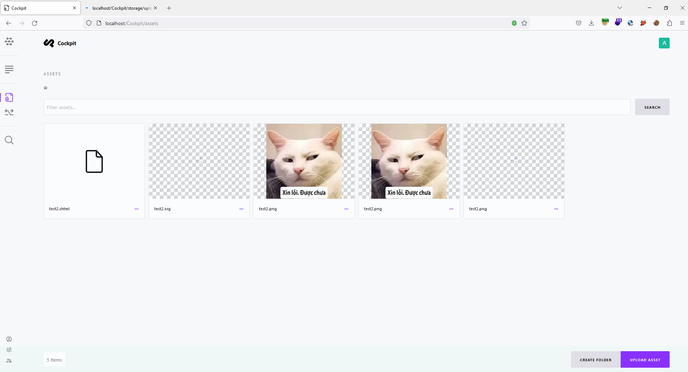

## In Cockpit CMS v2.6.3, I found Stored-XSS in upload assets feature
Cockpit CMS v2.6.3
Installation: https://github.com/Cockpit-HQ/Cockpit
Reproduce bug:
Step 1: Access to http://localhost/Cockpit/auth/login?to=%2F and log in to an account that has permission to upload assets. Go to Assets and click upload asset button to upload file.

Step 2: In upload feature, inject payload XSS:  into content file, and filename has the extension .shtml
 
Step 3: Access to images by using link in Copy asset link
 
And XSS payload will execute
 
